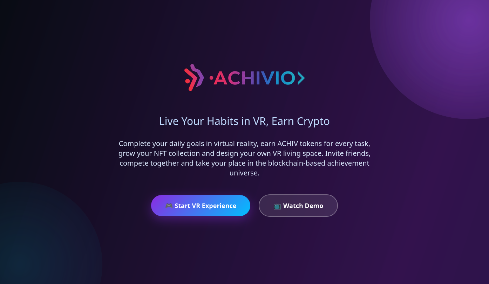

# Achivio - Blockchain Habit Tracker 🎯



> **Motivational habit tracking meets blockchain rewards and NFT achievements**

Achivio is a comprehensive habit tracking application built on the Stacks blockchain that gamifies healthy habits through token rewards, streak bonuses, NFT achievement badges, and customizable 3D virtual rooms.

## 🎨 Visual Showcase

<div align="center">

### 💎 ACHIV Tokens


### 🏆 Achievement System


### 🔥 Streak Rewards


### 🏠 Virtual Room Customization
<table>
  <tr>
    <td></td>
    <td></td>
    <td></td>
  </tr>
  <tr>
    <td align="center"><em>Modern Workspace</em></td>
    <td align="center"><em>Cozy Study</em></td>
    <td align="center"><em>Gaming Setup</em></td>
  </tr>
</table>

### 📊 Dashboard & Analytics


### 🏅 Leaderboard Competition


</div>

## 🌟 Features

- **Daily Habit Tracking** - Create and complete custom daily tasks
- **ACHIV Token Rewards** - Earn fungible tokens for completing habits
- **Streak System** - Bonus rewards for consecutive day completions
- **NFT Achievement Badges** - Collectible badges for milestones
- **3D Virtual Rooms** - Customize your workspace with earned items
- **Social Leaderboards** - Compete and compare with other users

## 🏗️ Architecture

Achivio consists of 6 interconnected smart contracts:

| Contract | Status | Purpose | Key Functions |
|----------|--------|---------|---------------|
| **achiv-token** | ✅ **LIVE** | SIP-010 fungible token for rewards | `mint-reward`, `transfer`, `burn` |
| **task-tracker** | 🔧 Development | Core habit tracking and completion | `create-task`, `complete-task` |
| **streak-system** | 🔧 Development | Consecutive day bonuses and milestones | `update-user-streak`, `claim-streak-bonus` |
| **nft-badges** | 🔧 Development | SIP-009 NFT badges for achievements | `mint-streak-badge`, `mint-task-master-badge` |
| **room-items** | 🔧 Development | SIP-009 NFT virtual furniture/items | `purchase-item`, `place-item-in-room` |
| **leaderboard** | 🔧 Development | User rankings and social features | `update-user-stats`, `compare-users` |

## 📱 User Interface

### Mobile App Screenshots


### Progress Tracking & Analytics


### Achievement Celebrations
<table>
  <tr>
    <td></td>
    <td></td>
    <td></td>
  </tr>
</table>

### Social Sharing


### Marketing Materials


## 🚀 Quick Start

### 🎯 **Live Deployment** 

**🔗 Deployed Contract:** [ST1PQHQKV0RJXZFY1DGX8MNSNYVE3VGZJSRTPGZGM.achiv-token](https://explorer.hiro.so/txid/ST1PQHQKV0RJXZFY1DGX8MNSNYVE3VGZJSRTPGZGM.achiv-token?chain=testnet)

**🌐 Network:** Stacks Testnet  
**📱 Frontend:** `http://localhost:3000` (local development)

### Smart Contracts

```bash
git clone https://github.com/gorkemsandikci/achivio.git
cd achivio
npm install

# Install Clarinet for contract development
brew install clarinet

# Check contracts
clarinet check

# Run tests
npm test
```

### Frontend Application

```bash
cd frontend
npm install
npm run dev
# Open http://localhost:3000
```

### Environment Setup

```bash
# Create .env file in frontend/
NEXT_PUBLIC_STACKS_NETWORK=testnet
NEXT_PUBLIC_CONTRACT_ADDRESS=ST1PQHQKV0RJXZFY1DGX8MNSNYVE3VGZJSRTPGZGM
```

### Deployment

```bash
# Deploy contracts to testnet
clarinet deployments apply --testnet

# Deploy contracts to mainnet (⚠️ costs real STX)
clarinet deployments apply --mainnet

# Deploy frontend
cd frontend && npm run build
```

## 📖 User Journey

1. **Create Habits** - Set up daily tasks with custom rewards
2. **Complete Tasks** - Earn ACHIV tokens for consistency
3. **Build Streaks** - Get bonus rewards for consecutive days
4. **Earn Badges** - Unlock NFT achievements for milestones
5. **Customize Room** - Buy virtual furniture with earned tokens
6. **Compete Socially** - Climb leaderboards and compare progress

## 🧪 Testing

```bash
npm test                    # Run all tests
npm test achiv-token.test.ts # Run specific tests
npm run test:coverage       # Run with coverage
```

## 📊 Tokenomics

- **70% User Rewards** - Daily task completion
- **15% Streak Bonuses** - Consecutive achievements  
- **10% Development** - Platform growth
- **5% Reserve** - Emergency fund

**Deflationary Mechanics**: Tokens burned through room item purchases

## 🔒 Security Features

- Daily completion limits prevent fraud
- Authorized minter controls
- Emergency pause mechanisms
- Comprehensive access controls

## 📚 Documentation

- [Contract Guide](docs/CONTRACT_GUIDE.md)
- [Deployment Guide](docs/DEPLOYMENT.md)
- [Security Audit](docs/SECURITY.md)
- [API Reference](docs/API.md)

## 🤝 Contributing

1. Fork and clone the repository
2. Create a feature branch
3. Write tests for new functionality
4. Submit a pull request

## 📄 License

MIT License - see [LICENSE](LICENSE) file for details.

## 📞 Support

- Documentation: [docs.achivio.app](https://docs.achivio.app)
- Discord: [discord.gg/achivio](https://discord.gg/achivio)
- Email: support@achivio.app

---

**Built with ❤️ on Stacks blockchain**